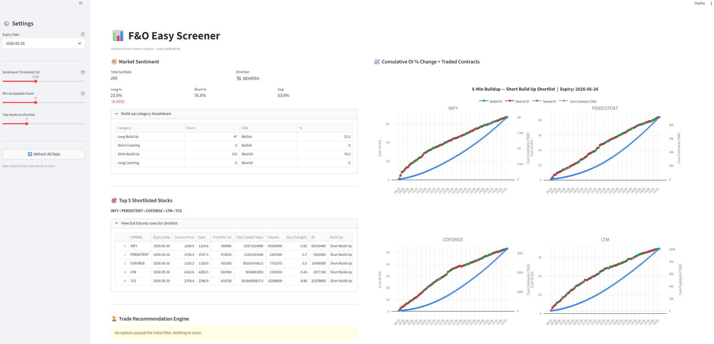
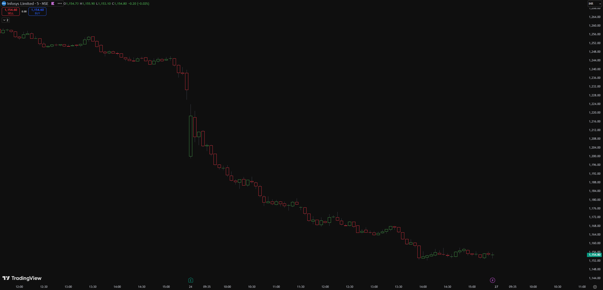

# 📊 F&O Easy Screener

A Streamlit dashboard that scans the full NSE F&O universe to identify directional sentiment, shortlist high-conviction stocks, and recommend OTM option trades — backed by intraday OI buildup analytics.

Built around three ideas:
1. **Aggregate sentiment** across all F&O symbols tells you which way the herd is leaning today
2. **Per-stock 5-min OI buildup** confirms whether shortlisted stocks have *sustained* momentum or just an opening spike
3. **Multi-factor scoring** of OTM options filters for trade quality (delta sweet spot, theta decay, IV vs peers, premium-to-spot ratio)

---

## 🖥️ Dashboard



The left panel shows market sentiment, the shortlist, and the recommendation engine. The right panel shows cumulative OI % change (segment-coloured by buildup type) and cumulative traded contracts for each shortlisted stock.

---

## 📉 Real-world signal validation

On **24-Apr-2026**, the screener detected a strongly bearish market (76.5% short vs 23.5% long, 53% gap) and shortlisted **INFY** as one of the top short candidates based on its Short Build Up + day-change profile.



INFY moved from ~₹1240 to ~₹1155 (-6.85%) over the session — confirming the signal that the screener flagged at the open. *Past performance is anecdotal, not predictive — see disclaimer below.*

---

## 🛠️ Tech Stack

- **Streamlit** — UI and reactive layout
- **Plotly** — interactive 2x2 subplot grid for OI buildup charts
- **Pandas** — data wrangling
- **Requests + BeautifulSoup** — Trendlyne API integration with CSRF handling
- **Python 3.10+**

---

## 🧠 What's inside

| Section | What it does |
|---|---|
| **Market Sentiment** | Aggregates `Long Build Up + Short Covering` (bullish) vs `Short Build Up + Long Covering` (bearish) across all F&O stocks for the selected expiry |
| **Top Shortlisted Stocks** | Picks the top N stocks aligned with the dominant sentiment, sorted by Day Change% |
| **5-Min OI Buildup Charts** | For each shortlisted stock, plots cumulative OI Δ% (segment-coloured: green=bullish OI, red=bearish OI) overlaid with cumulative traded contracts on a secondary axis |
| **Trade Recommendation Engine** | Scores OTM options on the shortlisted stocks across delta, OI surge, volume, premium-to-spot ratio, theta decay, and IV vs peer median — gates by minimum score and sentiment-gap thresholds |

---

## ▶️ Run it locally

```bash
git clone https://github.com/VivekChowdhury23/Futures-Screener-StreamLit-.git
cd Futures-Screener-StreamLit-

pip install -r requirements.txt
streamlit run main.py
```

Sidebar controls let you tune the sentiment-gap threshold, minimum acceptable trade score, and number of stocks to shortlist on the fly without re-fetching data.

---

## ⚙️ Scoring criteria

The recommendation engine awards points for:

- **Delta sweet spot** (0.25–0.45): +3
- **OI Change% surge** (>5000): +3
- **Volume** (>500k): +2
- **Volume Change% confirmation** (>1000): +1
- **Premium 0.5–3% of spot**: +2 (lottery <0.5% or expensive >5%: -2)
- **Low theta decay** (<10%/day): +2 (severe >30%/day: -3)
- **IV not elevated vs peer median**: +1 (>1.3× median: -2)
- **Deep open interest** (>500k): +1

A top pick must clear a configurable minimum score, *and* the sentiment gap must exceed the threshold, otherwise the engine recommends staying out.

---

## ⚠️ Disclaimer

This is a screener for **idea generation**, not financial advice. The scoring is heuristic and has not been backtested rigorously. Paper-trade signals before risking real capital.